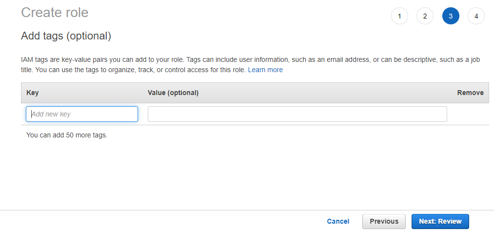

# GAN Training Documentation

Documenting an automated process for training and monitoring GAN models in AWS, Azure and GCP.

## Table of Contents

* [Dependencies](#dependencies)
* [AWS](#aws)
  * [VM Setup](#vm-setup)
  * [Training](#training)
  * [VM Teardown](#vm-teardown)

## Dependencies

* [Model training repository](https://github.com/sem-onyalo/gan-training-model)
* [Model training monitor repository](https://github.com/sem-onyalo/gan-training-monitor-flask)
* Infrastructure as code repositories
  * [AWS IaC repository](https://github.com/sem-onyalo/gan-training-iac-aws-terraform)
  * [Azure IaC repository](https://github.com/sem-onyalo/gan-training-iac-azure-terraform)
  * [GCP IaC repository](https://github.com/sem-onyalo/gan-training-iac-gcp-terraform)

## Setup

To setup training you'll need to create access roles for the VMs to write the training artifacts to blob storage. Then you'll need to clone the IaC repository for your chosen cloud provider.

### Cloud Setup

#### AWS

1. Navigate to the IAM service page.

    

2. Click on the `Roles` link.

    

3. Click on the `Create role` button.

    

4. Select the `EC2` use case link and then click on the `Next: Permissions` button.

    

5. Type `S3` in the search bar, select the checkbox for the `AmazonS3FullAccess` policy and then click on the `Next: Tags` button.

    

6. You can optionally add tags and then click the `Next: Review` button.

    

7. Enter the text "gan-training-blob-access" into the `Role name` text box and then click the `Create role` button.

    
