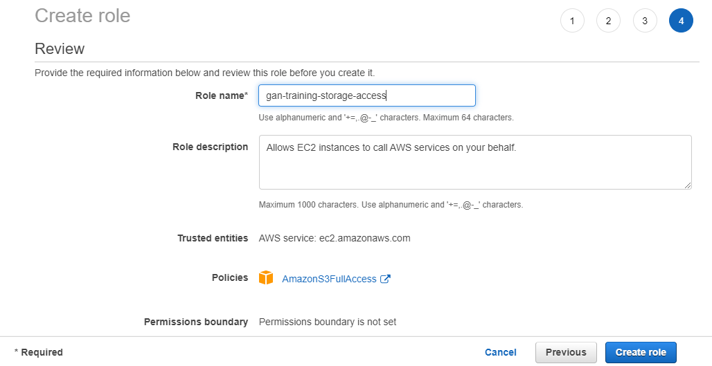

# GAN Training Documentation

Documenting an automated process for training and monitoring GAN models in AWS, Azure and GCP.

## Table of Contents

* [Dependencies](#dependencies)
* [Overview](#overview)
  * [Training and Monitor Repositories](#training-and-monitor-repositories)
* [AWS](#aws)
  * [AWS Cloud Storage Setup](#aws-cloud-storage-setup)
  * [AWS Training](#aws-training)
  * [AWS Training Teardown](#aws-training-teardown)

## Dependencies

* Terraform==1.0.10
* Infrastructure as code repositories
  * [AWS IaC repository](https://github.com/sem-onyalo/gan-training-iac-aws-terraform)
  * [Azure IaC repository](https://github.com/sem-onyalo/gan-training-iac-azure-terraform)
  * [GCP IaC repository](https://github.com/sem-onyalo/gan-training-iac-gcp-terraform)

## Overview

The first step is to setup access for the training and monitoring scripts running on their VMs to read and write to blob storage. Then you'll need to clone the Infrastructure as Code (IaC) repository for your chosen cloud provider.

### Training and Monitor Repositories

* [Model training repository](https://github.com/sem-onyalo/gan-training-model)
* [Model training monitor repository](https://github.com/sem-onyalo/gan-training-monitor-flask)

## AWS

### AWS Cloud Storage Setup

1. Navigate to the IAM service page.

    

2. Click on the `Roles` link.

    

3. Click on the `Create role` button.

    

4. Select the `EC2` use case link and then click on the `Next: Permissions` button.

    

5. Type `S3` in the search bar, select the checkbox for the `AmazonS3FullAccess` policy and then click on the `Next: Tags` button.

    

6. You can optionally add tags and then click the `Next: Review` button.

    

7. Enter the text "gan-training-storage-access" into the `Role name` text box and then click the `Create role` button.

    

### AWS Training

1. Open a new terminal, `cd` to your local code folder and clone the AWS IaC repository. Note that you will need to have local access to your AWS account (i.e. `aws configure`) to perform the following steps.

    ```
    cd ~/code
    
    git clone https://github.com/sem-onyalo/gan-training-iac-aws-terraform.git

    cd gan-training-iac-aws-terraform
    ```

2. Execute the `./run` bash script contained in the repository with the specified AWS specific commands.

    ```
    ./run -c 'python3 main.py --train -c aws_s3' -f 'python3 app.py -s aws_s3'
    ```

3. After the script finishes executing it will output the IP address of the VM hosting the monitoring page. Use that IP and port `8080` to monitor the training (for example, http://35.88.174.24:8080). Note that data on the webpage will not show up right away because the training VM needs time to spin up, install the required libraries and initialize the GPU for training.

    

3. You can use the `Evaluation epochs` dropdown to view the loss/accuracy plots, the generated images and the mini-batch training metrics for the selected evaluation epoch. This should help you to pick the model that generates the best images. Models for each evaluation epoch are stored in an S3 bucket called `gan-training-storage`.

    

### AWS Training Teardown

**IMPORTANT:** Remember to destroy the training VM when you have completed training and/or have downloaded your desired model, as it [costs money to keep up and running](https://aws.amazon.com/ec2/instance-types/p3/). You can destroy the resources with the following command.

```
terraform destroy -auto-approve
```
