### VM Setup

1. Navigate to the EC2 service page.

    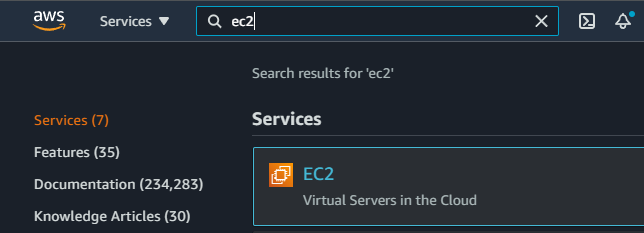

2. Scroll to the `Launch Instance` section and click the `Launch Instance` button.

    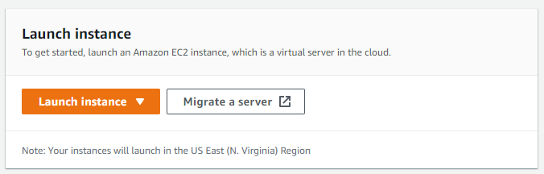

3. Click on the `Community AMI` tab, type `deep learning ami` in the search bar, hit enter and then select your preferred deep learning AMI (in this case, the Amazon Linux Deep Learning AMI).

    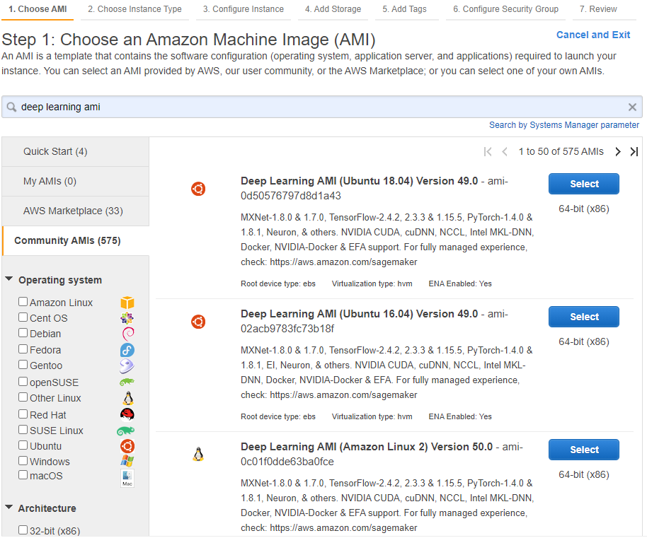

4. Select a GPU instance type (in this case, `p3.2xlarge`) and click on the `Review and Launch` button. On the `Review Instance Launch` page click on the `Launch` button.

    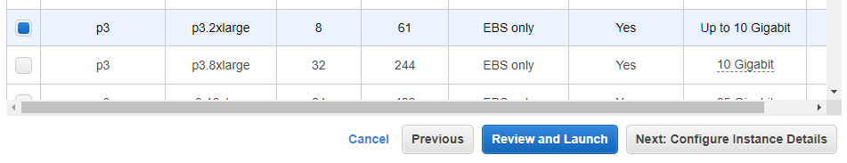
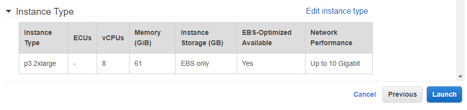

5. If this is your first time you'll need to create a new key pair. Give it a name and download the file. Otherwise, you can select an existing key pair and check the box acknowledging that you have access to the file. Click the `Launch Instances` button.

    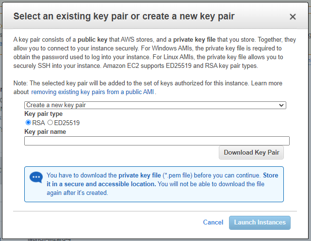
    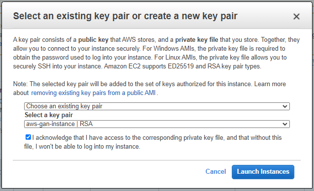

6. You can view your instance and its status on the `Instances` page under EC2 services.

    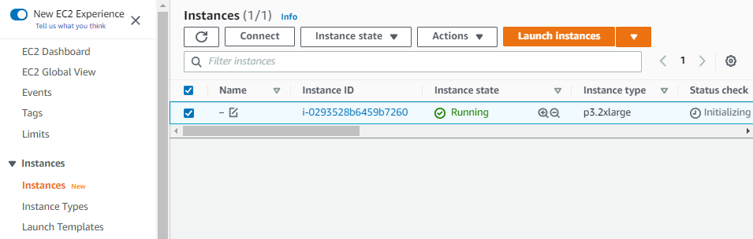

### Training

1. Click on your instance and copy the `Public IPv4 address` under the `Details` tab.

    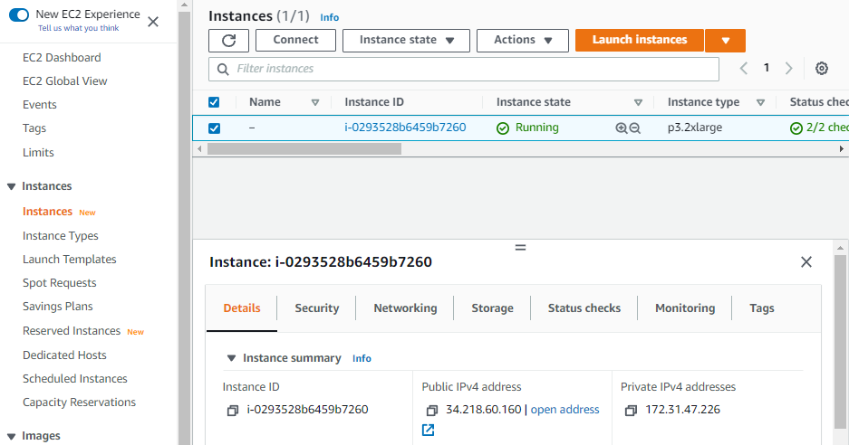

2. Open a terminal, change the directory to where you downloaded your key pair, then SSH into your instance.

    ```
    cd ~/Downloads/

    ssh -i aws-gan-instance.pem ec2-user@<ip-address-here>
    ```

3. After SSH-ing into your instance you will be provided with a list of environments you can use to train your model. You can pick the environment based on your model framework.

   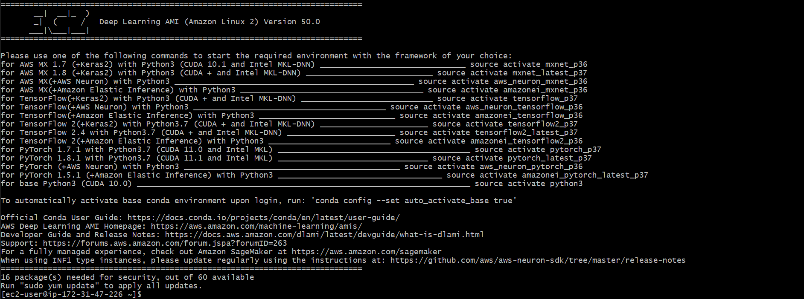

    ```
    source activate tensorflow_p37
    ```

4. Clone the git repository you'll be using for training, change the directory into the newly created code directory and start the training.

    ```
    git clone https://github.com/sem-onyalo/mlm-7-cgan-fashion-mnist.git

    cd mlm-7-cgan-fashion-mnist

    python main.py
    ```

5. When training is complete you can exit SSH.

    ```
    exit
    ```

6. If your training code saves evaluation data you can download them to your local computer.

   ```
   scp -i aws-gan-instance.pem -r ec2-user@<ip-address-here>:~/mlm-7-cgan-fashion-mnist/eval/* eval
   ```

### VM Teardown

It is **very important** to terminate your instance once your training is complete so that you don't get charged extra for running an expensive EC2 instance.

1. Click on your instance on the `Instances` page under EC2 services.

    

2. Click on the `Instance state` button, select `Terminate instance` and then click the `Terminate` button to confirm.

    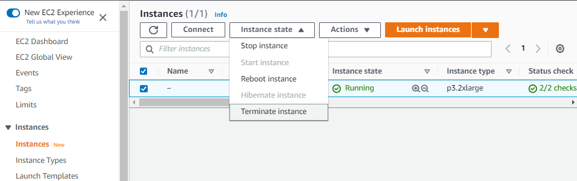
    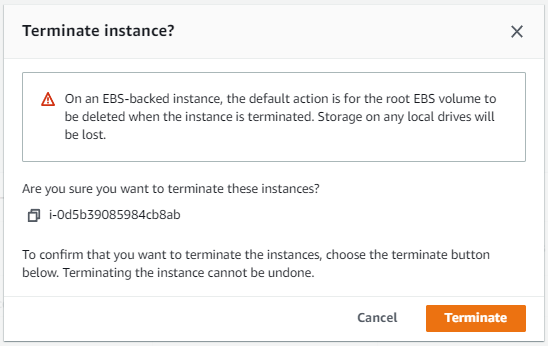
